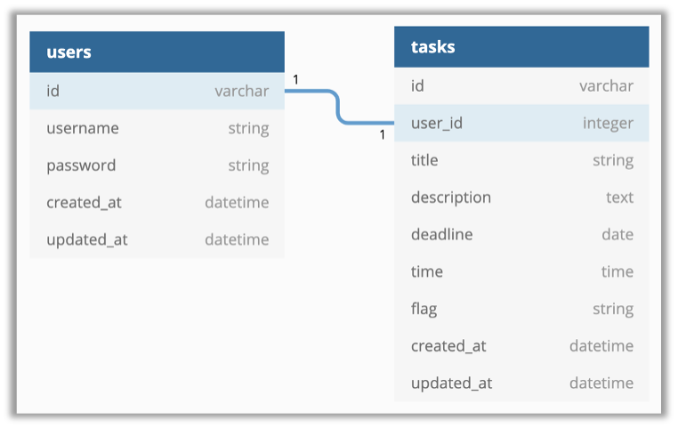

# README

**Assignment By**: Atin Sakker Hussain (A0225782Y)

This website is helps you manage your tasks easily, with an easy to use but elegant interface designed using Rails and a backend implemented using Rails.

## Versions
- Ruby 2.6.3
- Rails 6.0.3.4
- React 17.0.1

## Database Info

The User Model handles the user information and contains the username and password pairs. 
The Task Model handles all the task information including user id the task belongs to, title, description, deadline (date), time (optional) and a flag for tagging the task. 
The user_id field in tasks will be used to link the task to the user through its id field.

## Use Case

This website is designed to handle multiple users and each user is restricted to their own creating, reading, updating and deleting their own tasks associated with their account. There is no interference between two users. The user is greeted by a welcome screen that scrolls to the login form. The user can choose to go to the signup page to create an account or directly login.
A user once logged in, is taken to the main page where all the tasks are shown, grouped by their flag and sorted according to their deadline. A sidebar with list of all flags is given so as to easily navigate to tasks belonging to a specific flag. The user has three options for each task: “show”, “edit” or “delete”.
-	If “show” is chosen, the user is taken to a page that displays all information of the task. The fields are title, flag, description, deadline and time if applicable. The user can choose to edit or delete the task from this page too.
-	If “edit” is chosen, the user is taken to a page that displays all information and can update the fields.
-	If “delete” is chosen, a confirmation dialog is shown which on validation deletes the task from the database and also the user’s view.

## -----TO BE CONTINUED-----